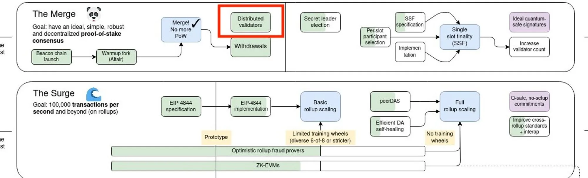
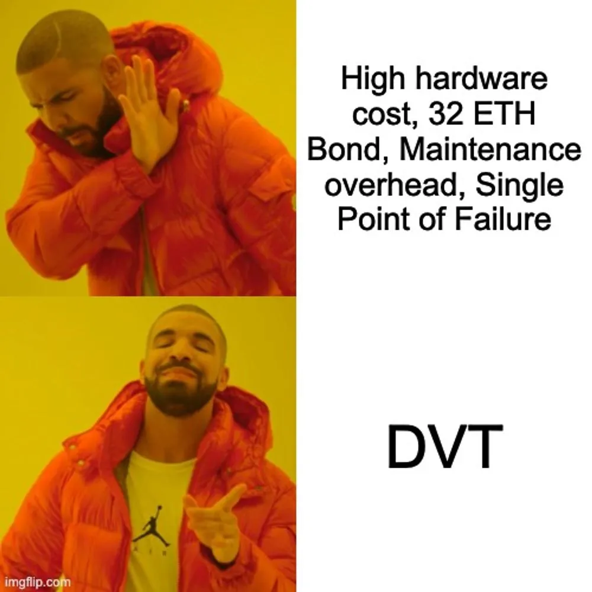
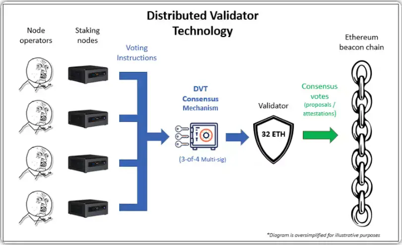
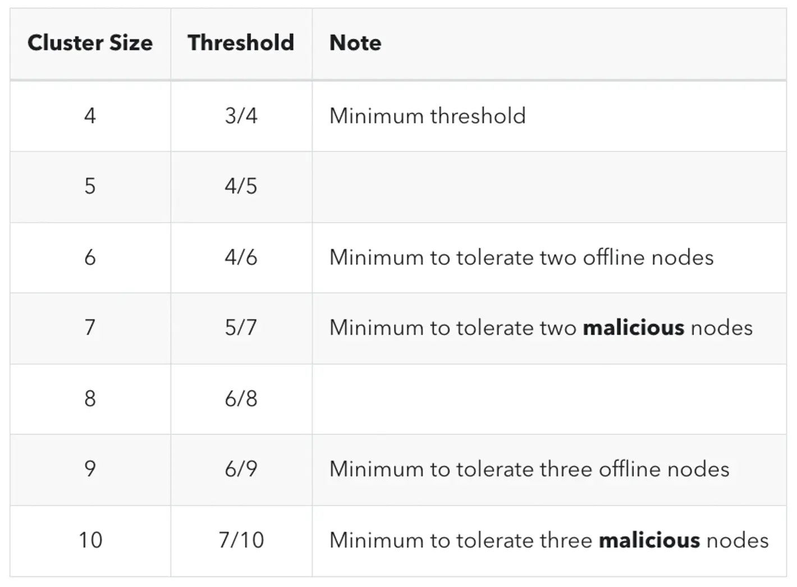
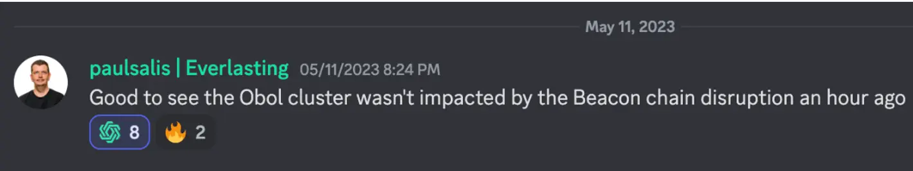
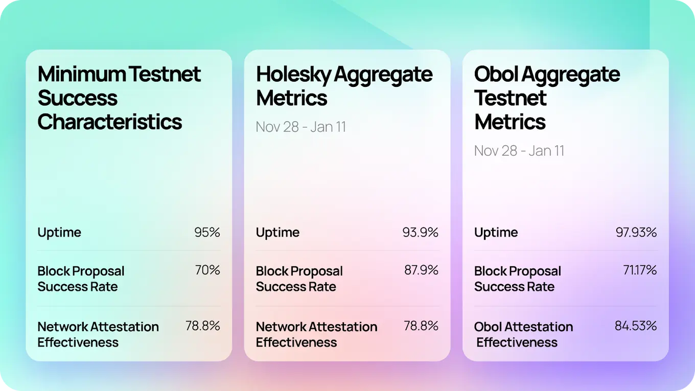
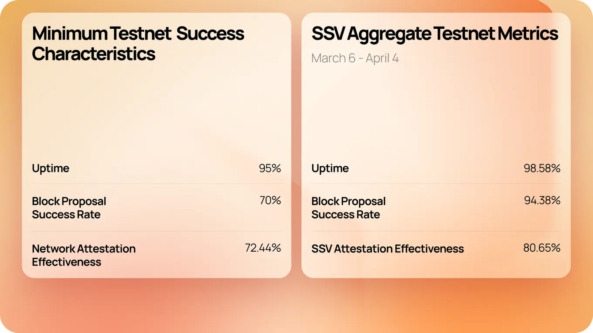

# **Introduction**

Reducing entry barriers for solo staking and improving the current validator setup are crucial for Ethereum's decentralization, making it more censorship-resistant and robust against attacks. That’s where Decentralized Validator Technology comes in. Distributed Validator Technology (DVT) is no longer the **NEXT** big thing on the [Ethereum Roadmap](https://x.com/VitalikButerin/status/1741190491578810445); it’s **ALREADY** a significant advancement, with live implementations on the mainnet by the smartest teams through a collaborative effort within the community.

But WTH exactly is DVT, and why should you care about it? (Trust me, you should, especially if you’re a solo staker.)

In this article, we dive into how DVT functions, its profound benefits for network integrity and decentralization, and its impact on various stakeholders within the Ethereum ecosystem. We will also explore ongoing efforts and live implementations of DVT on the mainnet.

# **The Problem with Validators Today**

Traditional validator setups on Ethereum often face centralization risks and high barriers to entry, requiring substantial initial capital (a minimum stake of 32 ETH plus hardware costs) and operational complexities. These limitations hinder the network's potential for true decentralization, with single points of failure posing risks of downtime and security breaches.

# **What Can DVT Do? How Can It Help?**

Distributed Validator Technology revolutionizes Ethereum's validator ecosystem by distributing responsibilities across multiple machines. This allows Ethereum PoS Validators to run on more than one node or machine, enabling a cluster of nodes operated by individuals, groups, or communities to function as a single validator on Ethereum. Running validators as clusters improves their resiliency and significantly reduces the slashing risk for honest validators, irrespective of their scale. This makes staking more robust and accessible for all validators.

<a href="https://rattibha.com/thread/1530589456872271872?ref=blog.pantherprotocol.io" target="_blank">(source)</a>

# **How does DVT Work?**

DVT operates on an Active/Active model where multiple nodes or machines work together to propose and validate blocks on Ethereum. This setup increases network resilience and enhances security by spreading out validation tasks across several nodes. Each node functions independently, which reduces the risk of failures and malicious attacks impacting the entire system. To understand how DVT works, let’s understand a few core concepts of DVT -

### **Distributed Validator (DV) Cluster**

A **DV cluster** is made up of individual machines or nodes holding a portion of the complete validator key, which ensures that the entire validator key is never stored in one place at any time, enhancing security.

### **Threshold BLS Aggregation**

This cryptographic technique combines partial BLS attestations of all individual machines or nodes in a DV cluster to create a complete validator node. It ensures that the DV cluster can function normally even if some nodes go offline, as long as enough nodes are active to meet the required threshold.

### **Fault Tolerance with Optimal DV Cluster Size**

Distributed validators are designed with built-in fault tolerance capabilities. This means the cluster can continue operating as long as the required number of active validator nodes (e.g., 3 out of 4, 5 out of 7) is operational and the DV cluster can validate transactions as expected. The size of a cluster, or the number of nodes/operators within it, plays a key role in determining its resilience. Larger clusters can handle more faulty nodes, but they also come with higher operational costs and potential network latency, which can negatively impact performance.

According to the [obol documentation](https://docs.obol.org/docs/charon/cluster-configuration), cluster resilience can be categorized into two main types:

1. **Byzantine Fault Tolerance (BFT):**  ability to tolerate nodes that actively attempt to disrupt the cluster.
2. **Crash Fault Tolerance (CFT):**  ability to tolerate with nodes that have crashed or become unavailable.

Different cluster sizes can tolerate varying numbers of Byzantine and crash nodes. Hardware and software crashes are common, while Byzantine behavior is rare. Nevertheless, Byzantine Fault Tolerance is vital for trust-minimized systems like distributed validators. Thus, the cluster size can be tailored to optimize either BFT or CFT, based on specific needs and threat models.

# **How can different entities benefit from DVT?**

### **Solo/ At-home validators**

- Solo staking is considered the gold standard for Ethereum. Solo stakers, or at-home validators, are the heartbeat of the Ethereum ecosystem. These are individuals or small groups running Ethereum nodes worldwide, making the network truly decentralized and globally distributed.
- In 2023, [thorough research by RatedWeb3](https://github.com/rated-network/solo-stakers?tab=readme-ov-file) estimated that approximately 6.5% of the ETH staked on the Beacon Chain was attributed to solo stakers. In February 2024, the filter was improved, increasing the estimation to 7.2% of the Beacon Chain as of validator index height 500k (One could argue that the various early stage mainnet implementations of DVT since then have had an impact). However it safe to assume that less than 10% of over 1 million validators today on the Ethereum mainnet are solo stakers. Why?
- Because running validator nodes on Ethereum often involves significant technical complexities, maintenance overhead, hardware costs, and a hefty self-stake of 32 Ethereum (roughly around $100K today).
- Using DVT modules, solo stakers can pool hardware resources and the minimum 32 ETH self-stake in a completely non-custodial manner. In this setup, multiple nodes or machines within a cluster share maintenance responsibilities, reducing overhead and avoiding single points of failure.
- Solo stakers can leverage DVT to split their keys across remote nodes, keeping their full private key offline. This approach allows solo stakers to:
    - **Reduce Hardware Costs:** By distributing the workload across multiple nodes, the need for individual, high-performance hardware is minimized.
    - **Increase Security:** Keeping the full private key offline and using key shares enhances security, protecting against potential exploits.
    - **Enhance Resilience:** Distributing tasks across several nodes reduces the risk of downtime or failure due to issues with a single node.
    
    In the following sections, we will explore how various entities within the Ethereum staking ecosystem are leveraging DVT to empower solo stakers.
    

### **Staking as-a-service providers and Staking Pools**

- Staking service providers like [Kiln](https://www.kiln.fi/), [P2P validators](https://p2p.org/), [Lugnodes](https://www.luganodes.com/), [Figment](https://figment.io/), and Staking pool like [Rocket pool](https://rocketpool.net/), [Lido Finance](https://lido.fi/) need to manage numerous validators for their users, typically institutional clients. With DVT, these platforms can implement crucial failsafes in their operations. Distributing key management can reduce operational costs for providers while also lowering risk.
- DVT enhances fault tolerance, reduces slashing risk, and lowers hardware and staffing costs for staking providers and, in many cases it can ease the process of acquiring slashing insurance for their clients.
- For instance, [the incident with Lido back](https://research.lido.fi/t/lido-on-ethereum-node-operator-infstones-platform-vulnerability-investigation-november-22-2023/6001/13) in November 2023, where a node operator shut down around 9,003 validators due to a security breach, could have been avoided with DVT, as the technology prevents complete validator key exposure and enhances security. We will see in the sections below how Lido eventually included a DVT module in their node operator setup to further enhance its resilience and security.
- [On February 4, 2021, 75 Ethereum validators from a staking pool were slashed](https://cointelegraph.com/news/expensive-lesson-75-eth2-validators-slashed-for-introducing-potential-chain-split-bug) (one of the largest slashing incident on ethereum )for producing competing blocks due to incorrect node configuration changes. [Distributed Validator Technology (DVT) could've prevented](https://x.com/0xyanshu/status/1699779106630754732) this by using an active-active setup, where validators are run across multiple nodes, ensuring that even if some nodes malfunction, the majority can maintain proper operation, thereby avoiding slashing and network risks.

# **Major Distributed Validator solutions on Mainnet**

### **Mainnet Implementation of DVT by [Obol](https://obol.org/)**

- Obol Labs, now known as Obol Collective, embarked on a journey to enhance Ethereum's consensus layer through their Distributed Validator (DV) middleware client, Charon.
- Charon's deployment on Ethereum Mainnet saw swift integration by industry giants like Lido and EtherFi, committing over $1.5 billion worth of stake to Obol DVs. Currently, Charon supports more than 175 operators across 35 countries, marking a significant stride towards decentralizing Ethereum's validator set.
- Obol recently released [Charon 1.0](https://blog.obol.org/releasing-charon-1-0/), the first long-term support (LTS) version of their DV middleware client.
- On May 11th and 12th, the Beacon Chain faced two distinct incidents where finality could not be achieved for 3 and 8 epochs, respectively. This issue arose from an exceptional scenario that placed a high load on some of the Consensus Layer clients.

<blockquote class="twitter-tweet" data-media-max-width="560">
We can start putting this loss of finality issue behind us, <a href="https://twitter.com/Teku_Consensys?ref_src=twsrc%5Etfw">@Teku_ConsenSys</a> and <a href="https://twitter.com/prylabs?ref_src=twsrc%5Etfw">@prylabs</a> have deployed fixes that will prevent the attestation flooding. This is one step on our diversity &amp; decentralization journey, let&#39;s learn from it and move forward with greater purpose. <a href="https://t.co/cSRgPTWeuy">pic.twitter.com/cSRgPTWeuy</a>
&mdash; superphiz.eth 🦇🔊🛡️ (@superphiz) <a href="https://twitter.com/superphiz/status/1657303471098404866?ref_src=twsrc%5Etfw">May 13, 2023</a></blockquote> 

- Notably, during this period, Obol had onboarded their first set of mainnet DV clusters in the Alpha Phase. None of these mainnet DVs were impacted by the outage. This resilience was due to the clusters running a diverse range of consensus clients in each node, which created fault tolerance within the cluster.

- Despite the lack of finality, the network continued to operate, allowing end users to transact because not all client implementations were affected, demonstrating the importance of client diversity.

### **Mainnet Implementation of DVT by [SSV.Network](https://ssv.network/)**

- SSV.Network has rapidly expanded to over 30,000 validators with close to 1 Million ETH staked across 700+ operators within just over 4 months since launch on mainnet. Originally designed as a permissionless, zero-coordination Distributed Validator Technology (DVT) network, SSV.Network allows anyone to operate and register validators without off-chain coordination.
- To address some of the scaling challenges with Distributed Validatos, SSV Labs is [implementing a phased roadmap](https://ssv.network/uncategorized/ssv-network-scaling-roadmap/) aimed at reducing hardware requirements by 75–90% over the next year. Recent optimizations in cryptography have already been deployed, with upcoming consensus enhancements slated for Q3. These improvements aim to support over 200,000 validators while maintaining current hardware standards, enhancing overall network performance and resilience.
- Let’s take a look at a real-world example of running validators with DVT implemented by SSV network for fault-tolerant, resilient, and secure validation operations and attestations.
- Last year the [DVStakers](https://x.com/DVStakers) Kenya Node experienced an outage due to internet issues (one can imagine this is common in remote areas). Fortunately, DVStakers were running their nodes on SSV network's DVT cluster, ensuring no downtime, as evidenced by the successful attestations below.

<blockquote class="twitter-tweet" data-media-max-width="560">
Zero downtime validators.  Our <a href="https://twitter.com/DVStakers?ref_src=twsrc%5Etfw">@DVStakers</a> Kenya Node went offline during some internet issues today, can you tell when it was offline by looking at our attestation success...? No! Since we&#39;re running an <a href="https://twitter.com/ssv_network?ref_src=twsrc%5Etfw">@ssv_network</a> DVT cluster, no attestations were missed 🥳 <a href="https://t.co/OBjBcX2ZCv">pic.twitter.com/OBjBcX2ZCv</a>
&mdash; DVStakers 🗺️ (@DVStakers) <a href="https://twitter.com/DVStakers/status/1686021155830870016?ref_src=twsrc%5Etfw">July 31, 2023</a></blockquote> 

- In contrast, if this were a solo staker or an enterprise setup, the validator would have been offline during that period.

# **Leveling the Playing Field: DVT’s Role in the Future of Ethereum Staking**

### [**Lido Simple DVT**](https://lido.fi/)

- Now coming to Lido Finance, it holds a significant importance in #Ethereum staking. [Around 30% $ETH Deposited to Beacon Chain is through Lido](https://dune.com/LidoAnalytical/Lido-Finance-Extended). To address concerns about centralisations and to expand the Lido Node Operator set to solo stakers and the community, Lido Finance last year proposed the ["Staking Router Module Proposal: Simple DVT,"](https://research.lido.fi/t/staking-router-module-proposal-simple-dvt/5625) in collaboration with leading the DVT networks Obol & SSV Network.
- The Simple DVT Module (sDVTm) allows solo and community stakers, alongside professional node operators, to participate in running validators using Lido's protocol by leveraging Obol and SSV Network’s DVT solutions to ensure liveliness, resiliency and security. This move diversifies the Lido Node Operator set significantly and strengthens Ethereum's overall validator infrastructure
- This module, approved via an on-chain Aragon vote in February 2024, representing a concerted effort to enhance decentralization and operational robustness within the Lido protocol.
- Following the successful and impressive results during various testing phases on the testnet, DVT demonstrated superior uptime, success rates, and overall effectiveness. Consequently, Lido has begun rolling out the [simple DVT module on the mainnet.](https://blog.lido.fi/simpledvt-new-phase-for-lido-on-ethereum/)
  
- [**Simple DVT: Obol Testnet Results**](https://blog.lido.fi/simpledvt-obol-testnet-results/)

- [**Simple DVT: SSV Testnet Results**](https://blog.lido.fi/simpledvt-ssv-testnet-results/)

    
- When new depositable ETH enters the Lido protocol, it will first flow into the Simple DVT Module. The Simple DVT Module will continue to accept ETH deposits until it either exhausts its capacity for depositable validators or reaches its operational limits.

### **Operation Solo Staker: Empowering Decentralized Ethereum Validation**

- [Operation Solo Stake](https://www.ether.fi/?ref=blog.obol.org)r is a collaborative effort started by [ether.fi](https://www.ether.fi/) and partners like Obol, dappnode, and Avado which aims to democratize validator participation on Ethereum by empowering solo stakers worldwide, regardless of financial or technical barriers by leveraging Distributed validator technology
- **Geographical Diversity:** Spanning 12 nations across five continents, solo stakers from locations as diverse as Kenya, Canada, and Thailand are contributing to Ethereum's security. This global spread enhances network resilience against geographic risks and centralization.
- **MEV Block on Mainnet:** Notably, Operation Solo Staker facilitated Ethereum's first distributed validator MEV (Miner Extractable Value) block on the Mainnet. This achievement highlights the group's technical proficiency and commitment to advancing decentralized validation practices.

<blockquote class="twitter-tweet" data-media-max-width="560">
Annnnnnnnnnd... that&#39;s a block!<a href="https://twitter.com/ether_fi?ref_src=twsrc%5Etfw">@ether_fi</a> Operation Solo Staker just proposed their first Ethereum mainnet block using DVT validators with solo stakers running from home 🤯  This block was proposed using <a href="https://twitter.com/ObolNetwork?ref_src=twsrc%5Etfw">@ObolNetwork</a> and <a href="https://twitter.com/dappnode?ref_src=twsrc%5Etfw">@DAppNode</a>, making it not only successful, but easy! <a href="https://t.co/uJozB18jgZ">pic.twitter.com/uJozB18jgZ</a>
&mdash; eridian.eth (@EridianAlpha) <a href="https://twitter.com/EridianAlpha/status/1694134849244709341?ref_src=twsrc%5Etfw">August 22, 2023</a></blockquote> 

- Operation Solo Staker is working to expand its impact through
    - **Permissionless DVT Onboarding:** Streamlining validator onboarding processes to enhance accessibility and reduce barriers to entry.
    - **Lower Bond Requirements:** Introducing alternatives for solo stakers to participate with reduced bond requirements, leveraging Distributed Validator Technology (DVT).
    - **Affordable Hardware Solutions:** Introducing Raspberry Pi solutions to lower hardware costs, enabling more individuals to participate in Ethereum's validation ecosystem.
    - By focusing on inclusivity, technical innovation, and community-driven decentralization, Operation Solo Staker exemplifies a pioneering approach towards securing Ethereum's network through distributed validation.

### DV Stakers

- We’ve discussed major players with distributed validator solutions and their significant contributions. Now, I want to briefly cover DV Stakers—long-time cryptocurrency enthusiasts and experienced Ethereum solo stakers who are advancing this technology at the root level.
- Last year, after successfully pitching on a [Lido Node Operator Community Call,](https://x.com/LidoFinance/status/1694266564642562100) they received [funding from Lido LEGO](https://research.lido.fi/t/dvstakers-grant-proposal/5346/1) in October 2023. This enabled them to start implementing [Kenya Node - Phase 2](https://www.dvstakers.com/kenya-node-phase-2). The goal was to set up a fully off-the-grid Ethereum validator in a rural Kenyan village, supporting the local community through education.

<blockquote class="twitter-tweet" data-media-max-width="560">
DVStakers spent this week in a small village in Kenya near Kilimanjaro setting up Ethereum full nodes, validators, and DVT validators. Powered by Starlink, solar panels, and batteries 📡☀️🔋  Full write-up next week!  Supported by <a href="https://twitter.com/LidoFinance?ref_src=twsrc%5Etfw">@LidoFinance</a> <a href="https://twitter.com/dappnode?ref_src=twsrc%5Etfw">@DAppNode</a> <a href="https://twitter.com/Homenodeorg?ref_src=twsrc%5Etfw">@Homenodeorg</a> <a href="https://twitter.com/ether_fi?ref_src=twsrc%5Etfw">@ether_fi</a> <a href="https://t.co/kbBQ6C19YG">pic.twitter.com/kbBQ6C19YG</a>
&mdash; DVStakers 🗺️ (@DVStakers) <a href="https://twitter.com/DVStakers/status/1745786436119322724?ref_src=twsrc%5Etfw">January 12, 2024</a></blockquote> 

- This initiative, along with efforts from Obol, SSV, EtherFi and DappNode, aims to empower rural Kenyan communities by providing electricity, internet, and educational resources. The long-term vision is to level the playing field in the Ethereum staking ecosystem.

# **Conclusion**

In this article we discussed how DVT's implementation offers several key advantages for Ethereum's infrastructure:

- **Uptime:** By distributing workload across multiple nodes, DVT ensures continuous operation despite individual node failures.
- **Resiliency:** Redundant validation processes reduce vulnerabilities to downtime and attacks, bolstering Ethereum's overall security posture.
- **Security:** Distributed key management and validation tasks across multiple nodes enhance resistance to malicious attacks and operational errors.
- **Decentralization:** Lowering entry barriers encourages broader participation in Ethereum's validator ecosystem, supporting the network's decentralization goals.

Distributed Validator Technology plays a key role in Ethereum's evolution towards decentralization, security, and accessibility in validator operations. DVT could also have some potential drawbacks such as introduction of an additional component, operational costs and potential Latency at large distances but brilliant teams are working on addressing these potential drawbacks through technological innovation with community collaboration at the centre of it for advancing the adoption and effectiveness of distributed validator systems.