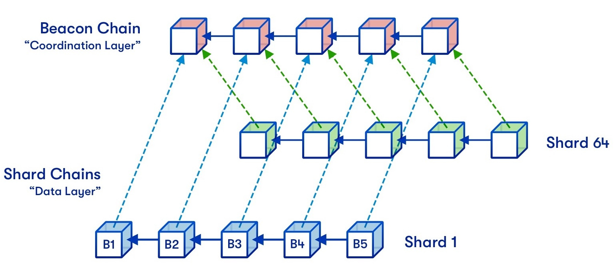

# Introduction

In retrospect, it’s fair to say that Ethereum has made a revolution in the world of crypto. The invention of virtual machines inside the crypto networks, allowing smart contracts, gave the start for the entire DeFi and Web3 ecosystem as we know it today.

However, this invention led to even more complexity to the scaling task that blockchains encountered since the inception of Bitcoin. Ethereum still processes 15 to 20 transactions per second—orders of magnitude less than traditional banking systems it strives to compete against. In this article, we’ll discuss the problem of scaling Ethereum and how the community is going to solve it today.

# Theory of Scaling

Ethereum is slow.

It is slow because all Ethereum nodes have to re-execute all transactions happening in the network themselves. This is the core premise of blockchains—you don’t have to trust any entity to process transactions, because you can process them yourself. However, this gives us the dilemma of the blockchain’s capacity: either you keep the capacity low so that running your own node is cheap but sending transactions is expensive, or vice versa.

As decentralization is the core thesis of Ethereum, the community aligns with the former side. Some other blockchains, such as Solana or BNB, have adopted another approach, prioritizing capacity over decentralization. This led to Ethereum being the most decentralized crypto network, but also the most expensive one.

The entire history of Ethereum is the community trying to figure out how to make it process more transactions while keeping the network as decentralized as possible. Firstly, we stuck to sharding.

# The Evolution of Scaling Solutions

## Sharding

Initially, the Ethereum community focused on sharding as a scaling solution. Sharding involves dividing the network into multiple interoperable chains, all coordinated by a central chain, called the “Beacon Chain.” These chains would have been operated by validators distributed into small sections called committees.

The approach isn’t new—various blockchains, such as NEAR and TON, use sharding since day 1.

The fundamental problem with sharding is its insecurity on the large scale. As all validators are distributed equally into the shards, each shard becomes economically easier to attack. This is not an issue if your total stake is $10 billion, and you have ten shards, but [to compete with VISA](https://cointelegraph.com/news/bitcoin-lightning-network-vs-visa-and-mastercard-how-do-they-stack-up), we would have to make 1200 of them! At today’s Ethereum stake at about $70 billion, this gives about $60 million of economic security per shard. Urgh, even Bryan Johnson would manage to attack it.

This is why Ethereum community spent years for fruitless research of sharding before coming up with an alternative solution—rollups.

## Rollups: The New Frontier

A rollup is a separate blockchain that processes transactions off-chain. Every once in a while, its _sequencer_ packs all rollups’ transactions in a single compressed element, called batch, and publishes them to Ethereum. In order for rollup and Ethereum to interoperate, the rollup’s _proposer_ asserts about its new state to the bridge smart contract on Ethereum. Then, the proposer proves the validity of this state against previously published transactions to the smart contract, and it can now process the transfers between these two networks.

Essentially, rollup runs _on top_ of Ethereum. This is why rollups are considered layer-two (L2) networks, and Ethereum—their parent, L1 network.

There are two leading ways for a proposer to verify the state of the rollup to its bridge:

### Optimistic Rollups

A proposer asserts about the rollup’s new state after executing all sequenced transactions sequentially (hence the name) and locks up a bond. Then, the bridge smart contract opens a _challenge window_, usually 7 days, in which anyone can propose a fraud proof—a verifiable assertion that any part of the proposed state doesn’t correspond to the original transactions. If the proof is valid, the state gets reverted, and the challenger takes the entire proposer’s bond. In practice, the interactive games are used instead, which are different in that the proposer and the challenger defend each other, but the idea is the same.

After 7 days with no valid fraud proofs, the state output is automatically considered valid, and the withdrawals from the L2 are processed according to this output.

Optimistic rollups reach scalability in that the L1 executes no computations. If the proposed state is valid, it will just be finalized in a week. As long as there’s at least one honest challenger in the network, the rollup’s bridge will always stay secure.

### ZK Rollups

A proposer asserts about the rollup’s new state after executing all batches and generates a _zero-knowledge validity proof_ that verifies that the execution of all these batches indeed results in the asserted state. This proof gets verified by the bridge smart contract, and it accepts the new state as valid.

Roughly speaking, ZK (Zero-Knowledge) proof is a set of mathematical equations that allow you to prove outputs of some computations without executing these computations yourself. For example, because they’re too hard for you to execute or because you don’t have some of the necessary values to execute it.

The important characteristic of ZK proofs is that it’s hard to generate them (much harder than computations that they prove) but extremely simple (in comparison to computations that they prove) to validate. That’s because in order to generate a ZK proof to some computations, you have to “convert” all these computations to lots of mathematical equations.

ZK rollups reach scalability in that the proof is only generated once, and the complexity of proof verification on the L1 is very low, comparable to sending 5-10 ERC20 transfers. As long as the ZK proof system contains no bugs and vulnerabilities, the rollup’s bridge will always stay secure.

# Is Sky the Limit?

As of the time of writing, rollups process about 110 transactions per second—9 times more than the Ethereum L1. Some rollups, such as Arbitrum, Base, and ZKsync Era, have already seen the record numbers of 150-200 TPS on them alone. The transaction fees on rollups [are less than a cent](https://www.growthepie.xyz/fundamentals/transaction-costs)—orders of magnitude lower than on Ethereum. The [DeFi on rollups is huge](https://defillama.com/chains/Rollup), and the most of Ethereum’s dApps are already deployed on leading ones. Moreover, a lot of projects, such as [Farcaster](https://www.farcaster.xyz), [Worldcoin](https://worldcoin.org), [Zora](https://zora.co), are rollups-native and have deployed on rollups since day 1.

This can make one wonder, did we really solve the scalability problem? Are rollups the perfect solution for scaling Ethereum? What’s to be done? Where’s the next billion users?

# Difficulties and Unsolved Tasks

## Technological Complexity

Rollups, both optimistic and ZK, are **very complicated** pieces of technology.

Challenging the output of the computer on-chain and generating cryptographic proofs for the entire virtual machines are quite the novel tasks. For instance, blockchains were the first systems using zero-knowledge cryptography in production. An Ethereum Virtual Machine wasn’t supposed to be challenged on another Ethereum Virtual Machine, either. Rollup teams are [spending millions of dollars on audits](https://x.com/code4rena/status/1708934949166825777) and teaching new developers how to find bugs in such systems.

And the most important problem of this complexity is that [tens of billions are at stake](https://l2beat.com/scaling/summary). Every bug can lead to unrecoverable losses. As rollups aren’t considered a part of Ethereum, they’re not a subject to hard-fork in case of a failure. This forces rollups to implement _training wheels_.

Training wheels are the trusted points in the system that allow a certain entity to stop or upgrade it in case of a bug. For example, the vast majority of today’s rollups [are instantly upgradable](https://l2beat.com/scaling/risk). This centralization factor is what discourages large projects to build on top of rollups. However, after they become more mature, the training wheels will slowly become obsolete. For example, at the time of writing, OP Stack has recently upgraded to the [Stage 1 trustlessness](https://medium.com/l2beat/introducing-stages-a-framework-to-evaluate-rollups-maturity-d290bb22befe), being the second major rollup after Arbitrum to do this. Arbitrum, in turn, is working on a [BoLD proof system](https://docs.arbitrum.io/how-arbitrum-works/bold/gentle-introduction), which allows it to integrate Stage 2 and become fully trustless.

## Data Availability

This problem is not related to the actions of the rollup ecosystem, but rather the Ethereum itself.

As you may have noticed, the crucial part of rollup state verification is sequencing—that is, publishing all transactions so that they can be used to verify the proposed state. If the ZK rollup’s transactions get lost, the proposers won’t be able to generate a ZK proof to them, halting the chain. If the optimistic rollup’s transactions get lost, the challengers won’t be able to challenge the proposer’s state output, potentially allowing them to steal all the funds from the bridge.

This is why the batches are posted directly to the Ethereum. Data stored there is as secure as everything else in the network, and as we’re already using Ethereum’s consensus as the source of trust, we don’t introduce any new trust assumptions. However, the data capacity of today’s Ethereum is heavily restricted.

Previously, sequencers were posting their batches directly to the blockchain, by putting its data into the transaction’s call data. This meant that the batches published back then are stored on Ethereum forever. You might have already guessed that this is a huge overkill, as these transactions are only needed for about 7 days on optimistic rollups and just the time for proof generation (a few minutes) on ZK rollups.

Ethereum developers have also realized this a while ago, and implemented [EIP-4844](https://eips.ethereum.org/EIPS/eip-4844), also known as Protodanksharding. This upgrade introduced blobs—temporary data cells that are pruned from the network after ~two weeks. The blobs greatly reduced the load on Ethereum block space, moving all rollups to the more efficient _blob space_. Specifically, [the throughput was increased by 5-10x](https://mirror.xyz/alexhook.eth/y9PTlM6tVr0H8X68r1LV2UwAnT9D6u1MEEiUFvcpyG0), giving us these amazing transaction speed numbers we have today.

Nevertheless, this is still certainly not enough for the world scale, so the Ethereum community will have to work on solutions that increase data storage capacity in the network. We’ll explore some of these solutions in the next article.

# Conclusion

Rollups are potentially the only world-level scaling solution we have today. Optimistic fraud provers are [already being tested in the permissionless environment](https://x.com/Optimism/status/1800256837088145799), and [ZK proof systems are steadily being optimized](https://x.com/dlubarov/status/1778092116377493711) to the levels allowing us to verify the Ethereum environment in real-time. Even today’s rollups handle billions of value and hundreds of transactions per second. The entire DeFi is building on top of rollups.

Ethereum community is actively working on increasing the data throughput in the network, which in combination with invaluable work of rollup teams will let us onboard the next generation of Web3 users in the nearest future. We’re building this future today. Let’s make Ethereum great again!

Thank you for reading.
