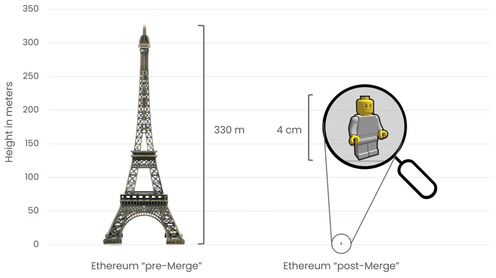

# Introduction

By the time Vitalik Buterin conceived Ethereum in late 2013, the budding crypto community had already come to terms with the fact Proof-of-Work (PoW), which powered most crypto networks at the time, was a deficient consensus mechanism. PoW consumed far too much electricity to be secure at scale. When there was not enough power in the blockchains, they were subject to [regular attacks](https://www.coindesk.com/markets/2020/08/29/ethereum-classic-hit-by-third-51-attack-in-a-month/). So even in the 2012-2013 period, projects like [Peercoin](https://www.peercoin.net) and [Nxt](https://en.wikipedia.org/wiki/Nxt) had already recognized these fundamental issues and Proof-of-Stake (PoS) had emerged as an alternative, but it was not to be for Ethereum. However, in late 2020, after several years of research, development and extensive testing. Ethereum transitioned from PoW to PoS in a process known as “The Merge.” Today it is the most secure PoS network and arguably more secure than even Bitcoin.

The transition to Proof-of-Stake is arguably the most technically and culturally significant upgrade till date. As you can probably imagine, changing consensus mechanisms is no trivial task–a small bug would have been catastrophic. This is one of the reasons why the upgrade was performed as a combination of two distinct parts (that needed to be merged) in the first place. This article will provide a (relatively) high level overview of The Merge and its significance.

# Consensus Mechanisms in Crypto Networks

_— Wait, what’s Proof-of-Work and Proof-of-Stake? Why are they even necessary?_

Unlike traditional banking systems, crypto networks have no central server processing all transactions. Instead, all network participants, called nodes, process transactions on their computers and exchange information. This decentralized approach eliminates the need to trust a single entity with everyone's funds, allowing users to verify all transactions independently.

But what if a user sends two mutually exclusive transactions at the same time? How can nodes agree on what transaction appeared first? Probably, they should confirm the first transaction they received, and the most common first transaction will be approved by the other nodes.

The infeasibility of this approach is in that the nodes, obviously, authenticate each other via internet connection. This means that the attacker can run multiple nodes to fake the consensus about a certain transaction.

This vulnerability is known as a [Sybil attack](https://en.wikipedia.org/wiki/Sybil_attack), where a single entity simulates multiple entities to gain undue influence in the system. So, a more robust method of authenticating network participants is needed to resist Sybil attacks.

## Proof-of-Work

[In the Bitcoin whitepaper](https://bitcoin.org/bitcoin.pdf), Satoshi Nakamoto proposed using a Proof-of-Work consensus mechanism, earlier used to combat email spam. The idea is to make all participants building blocks (batches of transactions) compute some useless but complicated and verifiable task, so that the chances of simultaneous generation of competing blocks become minimized.

This block building process was called _mining_, because the participants _mine_ for a specific _hash_ to be able to propose the block. Specifically, the mining process in Bitcoin is as follows:

1. A miner collects multiple transactions into a single block, including a number used solely to increment and change the block's fingerprint (hash).
2. The miner hashes the resulting block. According to the network’s rules, the hash must match a certain pattern, for example, contain four leading zero bytes.
3. If the hash meets these criteria, the miner submits it to the network. Nodes can instantly verify the proof of work since hashing is a simple operation.
4. If the hash doesn't meet the criteria, the miner increments the aforementioned number and rehashes the block. Even a slight change to the hashed value completely alters its hash.
5. If the new block meets the specified rules, proceed to step 3. If not, return to step 4.

In this example, miners will find the required blocks every ~4.2 billion (1 in 2564) hashes on average. In case there are too many miners or the hardware for mining becomes more powerful, the network adjusts the hash pattern, called target, every two weeks based on recent block generation times.

Bitcoin aims for a 10-minute block time. If blocks were generated every 9 minutes on average over the past two weeks, the network increases difficulty by 10%, and vice versa.

All nodes follow the chain with the most blocks, as it represents the most computational power expended. This is what provides Sybil resistance to the Proof-of-Work system.

### Problems

Despite being the most battle-tested consensus mechanism, Proof-of-Work has several significant drawbacks.

Firstly, popular PoW networks attract more miners, resulting in higher hash rates and increased security. However, this also leads to enormous electricity consumption. For instance, [Bitcoin mining consumes roughly as much energy as the entire country of Poland](https://digiconomist.net/bitcoin-energy-consumption). On a per-transaction basis, each Bitcoin transaction uses approximately the same amount of power as an average US household does in a month. At a global scale, this level of consumption could have substantial environmental impacts.

If your Proof-of-Work network _does not have_ high hash-rate, you have another problem—security. Attackers might find it profitable to rent computational power to reverse blocks in the blockchain, effectively double-spending their coins. Moreover, if the attacker uses general-purpose machines instead of specialized mining ASICs, changing the mining algorithm through a hard fork won't neutralize their hash rate. All you can do is wait until the attacker is tired.

Another disadvantage is that as the mining task has to be complicated, the transactions can’t be processed sequentially. Instead, transactions must wait for inclusion in a block. These blocks can't be generated too quickly, as this increases the likelihood of replacement by a longer chain. Users must then wait for multiple subsequent blocks to ensure their transaction's irreversibility.

If we look at the largest PoW chains, Bitcoin has 10 minutes block times, Monero—2 minutes, Litecoin and Zcash—2.5 minutes, and so on. Ethereum’s very complicated implementation of PoW allowed for 12 seconds block times, but they were accompanied by frequent chain reorgs, and the actual time was fluctuating between 10 and 20 seconds.

## Proof-of-Stake

In Proof-of-Stake, there are no miners. Instead, blocks are produced by _validators_. To become a validator, one locks a certain amount of the network's currency (e.g., ETH for Ethereum, PPC for Peercoin) and runs a node in block-producing mode. This locked currency, called stake, can be reclaimed after leaving the validator set, provided the validator behaved honestly.

Block producers are selected randomly, with higher stake increasing the chances of being chosen to produce the next block. Validators also vote on blocks produced by others. The chain with the most stake voted for is followed by all nodes. Both block production and voting are rewarded with newly generated coins, similar to block rewards in Proof-of-Work.

If ones behaves maliciously—for example, vote for two distinct blocks or produce two different blocks at the same slot—other validators will catch this and _slash_ them. Slashing means forced exit from the validator set with burning some of the violator’s stake. The amount burned varies based on the number of misbehaving nodes. For example, in Ethereum's PoS, accidentally running two nodes with the same validator key results in a 1 ETH slash for every 32 ETH staked. If two-thirds of validators engage in this behavior, they lose their entire deposit, as the network considers it a potential attack.

### Advantages

- **Energy Efficiency:** A single validator consumes as much electricity as a simple network node. This means the network's consensus energy consumption remains negligible regardless of network size, allowing PoS networks to scale globally with minimal environmental impact.
- **Lower Entry Barrier:** Anyone with the minimum stake can independently produce blocks. In Ethereum, a single validator requires 32 ETH (about $110,000 at current prices), which can be reclaimed at any time. Moreover, validators receive voting rewards regardless of block production. In contrast, to produce a Bitcoin block once a year on average, [one must spend ~$250,000 on ASICs and ~$25,000 annually on electricity](https://x.com/alexhooketh/status/1807371630890405945), with completely random production rates.
- **Security:** If a substantial portion of a currency’s total supply is staked, it might simply be impossible for an attacker to find enough liquidity to form a significant stake for attack. For instance, [about 33 million ETH](beaconcha.in) is currently staked in Ethereum. To attack the network, an attacker would need to either somehow steal 22 million ETH (\~$74 billion) or buy 66 million ETH (\~$223 billion) to control ⅔ of the total stake. Given Ether's total supply of about 120 million, such an attack is currently infeasible.

# Ethereum’s Consensus

When Ethereum was just released, developers chose Proof-of-Work as a network’s consensus mechanism. Even though [making it generate blocks every 12 seconds was quite a difficult engineering task](https://blog.ethereum.org/2014/07/11/toward-a-12-second-block-time), it was still much simpler than implementing PoS from day one. Back then, PoS protocols were not as safe as PoW because lacked handling various attack vectors, and Ethereum community wanted to engineer the best Proof-of-Stake design. It quickly turned out that this is a really complicated task, so PoS was delayed and eventually made it into the network 7 years later.

## Gasper PoS, Beacon Chain

After years of research and development, Ethereum’s consensus layer network was launched on December 1st, 2020.

_— Wait, “network”? Don’t we already have an Ethereum network?_

That’s right. To ensure a smooth transition in consensus mechanisms, the new system needed to be mature and secure enough to prevent any security issues. This led the Ethereum community to launch a separate network solely for consensus. Users could deposit their ETH, run their own validator, vote for blocks, and build their own blocks, but they weren't actually verifying the main Ethereum network, now called the "execution layer." This approach allowed Ethereum users time to set up their own validators and ensure the Proof-of-Stake consensus was sufficiently secure before connecting it to the execution layer.

Ethereum's new PoS design, called "Gasper," features several innovative elements:

- Everyone can become a validator by locking fixed 32 ETH. No more, no less.
- All validators can produce blocks, with roughly equal chances due to their fixed balance.
- Validators vote on epochs (batches of 32 blocks) rather than individual blocks. An epoch is considered finalized when ⅔ of the stake votes in its favor, making it impossible to revert without slashing at least ⅓ of the entire network's stake.

This introduces _finality_, allowing users to be certain their transaction won't be reversed after a specific number of blocks, while keeping the computational load on nodes low. As the minimum staking balance is low, a lot of validators joined the network. If all their signatures were processed every block, that would produce too much load on the network.

- Validators earn rewards for both proposing blocks and voting on epochs, ensuring every validator starts earning ETH from its very first second of operation.
- If a validator behaves maliciously, it gets slashed. The slashed amount increases respectively to the number of malicious validators. This introduces not only attack price, _but the attack cost._
- The Altair upgrade introduced sync committees: sets of 512 validators elected every 256 epochs (~27 hours) that vote on already finalized epochs. These votes enable light clients to efficiently synchronize with the network without processing all original epochs.

Initially, the PoS network was called the "Beacon Chain," as the original plan for scaling Ethereum involved sharding the network into multiple parallel chains, with the Beacon Chain coordinating them. After this idea was abandoned in favor of rollups, the term "Consensus Layer" became preferred.

_— Okay, now we have two large distinct blockchains, barely knowing about each other! How do we connect them?_

## Changing Airplane Engine Mid-Flight

Integrating a consensus mechanism into a new network is straightforward—you simply build the code around the mechanism. However, integrating a new consensus mechanism into a network that has been operational for years, handling billions in economic activity, and cannot be halted even for a minute, presents a far greater challenge.

### Difficulty Bombs

The first thing that was done is difficulty bombs. A Difficulty Bomb is a mechanism that exponentially increases mining difficulty to discourage miners from continuing on the old version of the network. The point at which mining becomes too difficult to sustain the chain was informally dubbed the "Ice Age."

Without the difficulty bomb, a group of mining pools opposing the transition to Proof-of-Stake could simply continue using an old version of the node software. This could potentially lead to mining pools colluding to keep individual miners on the old chain, potentially causing users to remain on it and effectively ruining The Merge.

With the bomb in place, those disagreeing with the transition would need to implement a hard fork to defuse the bomb as well, as otherwise they would be stuck in the Ice Age. This way, the community left no “legitimate” version of the chain that could derail the transition to PoS.

And this actually helped—[ETHW fork](https://coinmarketcap.com/currencies/ethereum-pow/), [sponsored and coordinated by Justin Sun](https://www.coindesk.com/markets/2022/09/16/ethereum-proof-of-work-fork-crashes-as-justin-suns-poloniex-supports-rival-fork/), owner of the Tron Network, had to undergo a hard fork that forced the chain to launch several hours after The Merge of the canonical chain. This divergence from the canonical chain, combined with a lack of supporting infrastructure, [led to the death of the fork shortly after its inception](https://coinmarketcap.com/currencies/ethereum-pow/).

_Justin Sun with the CEO of ETHW. You can notice pain in this smile._

### Node \* 2

As the initial version of the Consensus Layer didn’t agree with Execution Layer on its state, there was no necessity in running both nodes to be a validator. The only thing that was needed is the state root of the EL, so that the CL could process validator deposits. This led to most validators connecting their CL nodes to Infura’s public endpoint that provided state roots of EL. However, post-Merge, this was no longer viable, as EL and CL needed to become synchronously interoperable.

The difficulty is, running two nodes of large networks is much more computationally intensive than running a single newborn network’s node. That being said, a lot of validator nodes were run on the machines that could handle a CL node, but not both! For instance, a Raspberry Pi 4 microcomputer could easily manage a CL validator node but struggled with both, even without a validator.

The Ethereum community launched an extensive campaign to promote the necessity of upgrading validator nodes and, if needed, hardware. Numerous [guides](https://ethereum-on-arm-documentation.readthedocs.io/en/latest/index.html) and [resources](https://gist.github.com/yorickdowne/f3a3e79a573bf35767cd002cc977b038) were created to assist people in preparing for The Merge. This effort paid off—after The Merge, the participation rate dropped by less than 5%, indicating that the vast majority of validators successfully prepared their nodes for the upgrade.

### Terminal Total Difficulty

While the difficulty bomb mitigated the risk of mining pools behaving maliciously after The Merge, individual miners still had the option to "vote" against it beforehand. How?

Instead of using a specific block number to trigger the fork, nodes were configured to detect the time for The Merge by monitoring the total mining difficulty expended to build the chain. If miners opposed the upgrade, they could halt their mining hardware, decreasing network difficulty and delaying the fork.

The Execution Layer nodes were configured as follows:

- For each new PoW block, update the total difficulty spent on mining the longest chain.
- If the total difficulty is more or equal to the Terminal Total Difficulty, disable the function responsible for PoW consensus, connect to the Consensus Layer node through the local internet, and wait for the new block headers, _now decided on by Proof-of-Stake_.

As the majority of users and miners supported the transition, at 06:42:42 UTC on September 15, 2022, the Ethereum network built its last PoW block—[15537393](https://etherscan.io/block/15537393).

## The Merge

[The first block in the PoS Ethereum](https://etherscan.io/block/15537394) was built by [validator #347963, owned by the Celsius staking pool](https://beaconcha.in/validator/347963). Users eager to have their transactions included in this historic block paid substantial priority fees, resulting in it collecting over 45 ETH in fees alone. The ETH issuance rate plummeted by approximately 90%—a drop informally dubbed the "Triple Halving," as a reference to the Bitcoin’s halving.

Shortly after, burn rate due to [EIP-1559 burning mechanism](https://eips.ethereum.org/EIPS/eip-1559) surpassed the issuance rate, making ETH the world's first deflationary cryptocurrency. This sparked the ["ultra-sound money" thesis](https://ultrasound.money), suggesting that if Bitcoin with its potentially limited supply is considered sound money, then deflationary Ether must be ultra-sound!

Electricity consumption plummeted by 99.95%, [from levels comparable to Finland's consumption to nearly an order of magnitude lower than Netflix's infrastructure](https://ethereum.org/en/energy-consumption/). Ethereum's carbon footprint decreased almost 10,000-fold—from 11,016,000 to 870 tonnes CO2e.

_Graph for comparison_

Finally, Ethereum evolved into an unassailable and unstoppable world machine, resistant to all manner of attacks and cataclysms. It became the Ethereum we know today.

# Conclusion

After about 8 months, on April 12, 2023, Ethereum implemented another hard fork—Shapella. This upgrade allowed validators to withdraw their stake from the Consensus Layer. Specifically, users could now choose to withdraw all rewards above 32 ETH or withdraw their entire stake, deactivating their validator. This upgrade completed the cycle of connection between Execution and Consensus layers, unifying them into a single Ethereum network.

The Merge undoubtedly stands as Ethereum's most significant upgrade, being the foundation stone for all subsequent improvements and paving the way for Ethereum to scale to the next billion users. By liquidating the technical debt of the insecure and outdated Proof-of-Work system, it greatly simplifies the development of new technologies in Ethereum. For instance, [EIP-4844](https://eips.ethereum.org/EIPS/eip-4844), [which increased rollups' TPS by 5-10x](https://mirror.xyz/alexhook.eth/y9PTlM6tVr0H8X68r1LV2UwAnT9D6u1MEEiUFvcpyG0), would not have been feasible without Proof-of-Stake!

The vast majority of Ethereum's future improvements will build upon the path forged by The Merge. We must remember its significance in Ethereum's history and remain mindful of our surroundings as we construct the future. Let's make Ethereum great again!

Thank you for reading.
