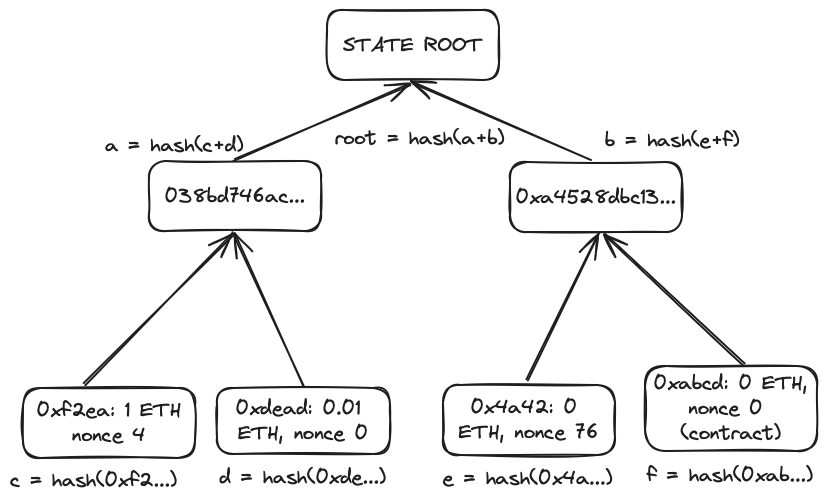

# Introduction

The state growth has become one of the largest L1 scaling barriers. Unlike historical blocks, storing the entire network state is required for validating the blockchain, so it can’t be safely pruned over time, and grows more and more as the time passes. With state growth, hardware requirements for running a node increase, further reducing the number of people who can run a node.

Verkle Trees are intended to fix the problem of growing state by allowing it to be enshrined into the blocks, introducing the so-called “statelessness.” We’ll explore the large part of The Verge, one of the steps of the roadmap, which consists of the related proposals.

# The State

Ethereum is a distributed virtual machine. All nodes run the same instance of this virtual machine, and transactions happening in Ethereum can call the programs inside it, called “smart contracts.” These contracts would be useful if they had no memory (imagine having a computer with no hard drive), so this virtual machine has to have some internal drive. This global drive is called the state.

The state consists of accounts, their storage, and attributes. These attributes are usually the balance, the nonce (a number of transactions sent from the account) or the contract code. The storage can be thought of as a directory made specifically for this account. An Externally Owned Account, from which we send transactions, cannot access its storage, as it’s supposed to be used by the smart contracts. And vice versa—a smart contract has no nonce, because it can’t send transactions.

Specifically, this storage is a set of key-value pairs, 64 (32+32) bytes each. For instance, ERC20 tokens, such as USDC, use their storage to store the users’ balances and allowances. These elements can be updated by calling the respective function in the smart contract.

Every transaction happening in the Ethereum Virtual Machine incurs a _state transition_, that is, a change in any element of the state. At very least, this is a nonce of the sender, which is incremented with every transaction sent. Then, balance reduction (as you pay a fee for a transaction), possibly balance increase on the other account if you sent some ETH, changing of two storage elements if you sent an ERC20 token, and so on.

## Merkle Trees

The Ethereum’s state is stored in the form of a Merkle Tree. It was chosen because Merkle Trees allow for generation of short (compared to the size of the tree) proofs that a certain element exists in the tree.

In Merkle Trees, all elements, called leaves, are [hashed](https://en.wikipedia.org/wiki/Hash_function) in pairs (not quite pairs, but we’ll skip it for now), these pairs get hashed with other pairs, and this process is repeated until the root of the tree is reached. The root is some kind of “super-hash” which was made by hashing all the elements in the tree. This means that by having an element, a tree root, and the hashes of neighboring elements at all heights, we can verify that the element exists in the tree, without revealing the entire tree!

In this example, to verify the account 0xf2ea, we hash its value into C, get the hash D of the neighboring element, and hash their combination to get A. We then get the hash B, and hash the combination of A and B to get our state root! This way, we only needed one element and two hashes of neighboring elements, instead of all the four elements.

This is called a Merkle Proof. Ethereum has adopted it so that the light client could verify the needed elements of the state without having to download the entire state themselves.

## Why We Need State

_— Why can’t the light client just download the block and execute it themselves to find the necessary value?_

Because the execution of the block will require the state from the previous blocks, and so on. Similarly to how a program on your computer won’t run without necessary libraries installed, the block in Ethereum is not standalone and cannot be executed without state context.

This state context must always be kept by a node, because otherwise it won’t be able to execute the newly generated blocks. So, unlike blocks, the historical state cannot be deleted, because it may be used in the future.

_— Why can’t the block producers just provide the Merkle proofs for every state element used in their block, so those who verify the block don’t have to store the entire state?_

Hmm. That’s completely an option! However, there are too many state accesses in the Ethereum blocks, so storing a Merkle proof for each one would make the block too large.

# Verkle Trees

As you might have guessed, the point of Verkle Trees is to decrease the size of state proofs.

Instead of hashing, Verkle trees use special cryptographic primitives, called vector commitments (hence the name). These commitments allow for the proof to only provide all the parent elements, without neighboring ones.

This, in turn, allows us to make the tree much wider. For example, from two elements per leaf, to 256—once a byte. All this makes Verkle proofs significantly smaller than Merkle proofs.

## The Philosophy of Statelessness

In an ideal stateless Ethereum, all blocks contain Verkle proofs for every used state element, that are verified against the previous state root and form the new one. Therefore, the blocks become standalone—you can download any block and fully verify it from scratch. This heavily improves the speed of spinning up a new node, as you don’t have to rebuild the entire state and merkleize it every block.

As the nodes no longer have to spend time merkleizing all the state transitions or build a state at all, we can greatly increase the block gas limit. The actual safe numbers are obviously not yet known, but we can think of 2-5x increase.

_— Wait, but we still store the state! It’s just in the blocks!_

Sure. And the blocks can be pruned using [EIP-4444](https://eips.ethereum.org/EIPS/eip-4444). If we’ll need older state, we can look for it using BitTorrent or the Portal Network, currently in development specifically for this purposes. This way, we store nothing about the network which is older than a specified amount of time (probably a year). This will decrease the storage requirements to just a few hundred gigabytes.

_An important note: block producing nodes will still have to store the state, because they need to generate the Verkle proofs for their blocks. However, as Merkleizing is no longer required, the state can be stored in a much more storage-efficient manner._

## How to Verkle the Merkle

The difficulty with transitioning to the Verkle trees is that we already have a large Merkle tree that has to be converted into Verkle. Currently, four approaches are proposed:

### Overlay Method

By this design, after the Verkle fork, the network starts with an empty Verkle tree, and a read-only base tree (the existing Merkle tree). Every block, a specific number of elements are copied from the base tree to the overlay tree. When reading the state, the node first searches the overlay tree for a key, and if it’s not found then searches the base tree. All updates are recorded on the new tree.

### Conversion Node

The community sets up a small group of very powerful machines that convert the tree at a fixed block height, and then share the result with the rest of the network. Less powerful clients download the conversion and replay blocks in Verkle mode until the head has been reached.

### Local Bulk

Similar to the “Conversion Node” method, but every node converts the tree itself.

### State Expiry

The same as the overlay method, but no automatic conversion happens. Instead, elements are moved into the new tree on demand.

# Conclusion

Even though the rollups are feasible enough to scale to the world levels, they still need a powerful foundation. The Ethereum L1 has to be fast enough to handle all the rollups and interoperability protocols. And the Verkle trees are the first step towards L1 scalability.

Eventually, the entire Ethereum network will be moved onto ZK rails, but it’s unlikely that this’ll happen in the near future. Statelessness, however, is more than possible to implement. Although the research is still going, we’ll probably see the first stateless clients in a fork or two after the upcoming Pectra.

Moreover, by adopting the novel approaches in scalability on L1, we give more food for research to the rollup engineers, possibly resulting in more designs in the rollup ecosystem as well. Let’s make Ethereum great again!

Thank you for reading.
