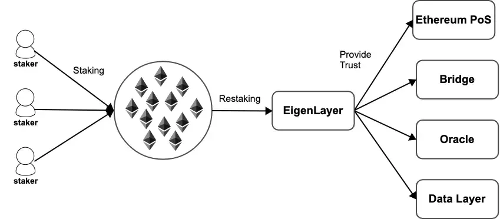
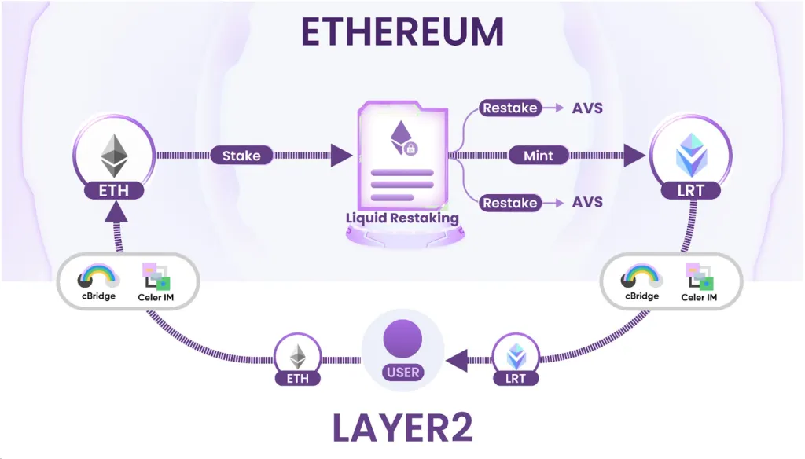
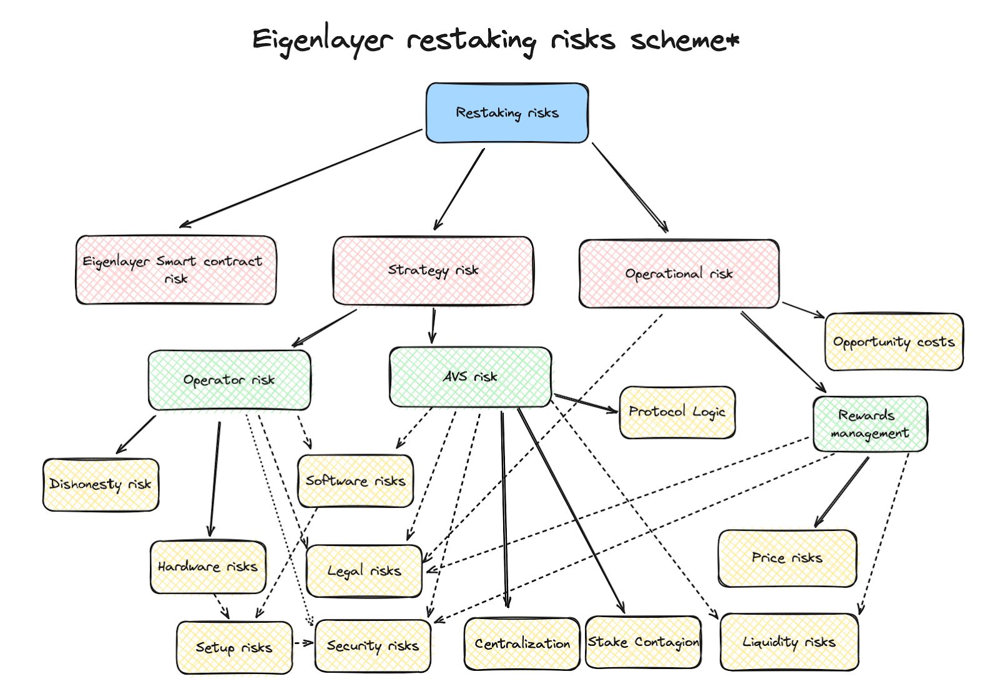

Staking emerged as a popular way to earn rewards and actively participate in network operations. By holding and locking up a certain amount of cryptocurrency, individuals can support the security and functionality of blockchain networks while earning passive income.

[Cryptocurrency staking](https://transak.com/blog/what-is-crypto-staking) is a cornerstone of Proof of Stake (PoS) blockchains, offering a more energy-efficient and inclusive alternative to the traditional Proof of Work (PoW) model.

However, staking comes with a set of drawbacks. Capital inefficiency, limited network participation, and liquidity constraints are some of them.

**Enter restaking.**

Restaking allows you to essentially "**stake your stake,**" compounding your earnings and further deepening your involvement in the network. **It's like earning interest on your interest, maximizing your returns from the cryptocurrencies you already hold**.

While staking itself offers a range of benefits like passive income and network security, restaking takes these advantages a step further, opening up new avenues for maximizing your crypto gains.

**In this article, we'll explore the intricacies of restaking, exploring its mechanics, benefits, and potential risks.**

## Understanding Staking

Before diving into the intricacies of restaking, it's essential to establish a solid understanding of staking itself.

**At its core, staking involves locking up a specific amount of cryptocurrency in a wallet to support the network's operations.** Think of it as a way to contribute to the network's security and efficiency while earning rewards in return.

In the context of [Proof of Stake (PoS)](https://ethereum.org/en/developers/docs/consensus-mechanisms/pos/) blockchains, staking helps validate transactions and add new blocks to the chain. Unlike Proof of Work (PoW) systems that rely on computational power to achieve consensus, **PoS allows token holders to validate transactions based on the amount of cryptocurrency they stake.**

The more tokens you stake, the higher your chances of being selected to validate transactions and earn rewards.

Staking offers a range of benefits beyond just passive income.

- It helps secure the network by making it more expensive for malicious actors to attack.
- Staking can also give you a voice in network governance, allowing you to participate in decision-making processes.
- Staking can contribute to a more environmentally friendly blockchain ecosystem compared to the energy-intensive PoW model.

However, staking also comes with its share of risks.

- One potential risk is slashing, where a portion of your staked tokens can be lost due to validator misconduct or network issues.
- Another consideration is illiquidity, as your staked tokens are typically locked for a certain period, limiting your ability to access them immediately.
- Market volatility can impact the value of your staked assets and the rewards you earn.

## What Is Restaking?

**Restaking is a mechanism that enables the delegation of staked assets to another validator node, without unstaking the original assets.** This allows the original staker (delegator) to earn additional rewards on their staked assets, while also supporting the network's security and decentralization.

In simple terms, restaking is the process of staking your already staked tokens or the rewards earned from staking on another platform or protocol.

The core concept of restaking revolves around delegating the staking power derived from initially staked assets to another validator. This delegation doesn't necessitate the original staker to unstake or move their assets from their original validator.

Restaking introduces an additional layer of validation and security to the network. The original validator, where the assets are initially staked, acts as a custodian and ensures the security of the staked assets. The restaked validator, on the other hand, leverages the delegated staking power to participate in the consensus mechanism and earn rewards.

## Restaking And EigenLayer

[EigenLayer](https://www.eigenlayer.xyz) **is widely recognized as the protocol that pioneered restaking. It introduced the concept of "restaking" as a fundamental primitive on the Ethereum blockchain**, enabling ETH stakers to actively participate in validating new applications and protocols built on top of Ethereum while earning additional rewards.

EigenLayer addressed a key challenge in the blockchain ecosystem: the need for new applications and protocols to establish their own trust and security mechanisms, often requiring them to bootstrap their own validator sets and token economies. This process can be time-consuming, costly, and inefficient.

Restaking offered an elegant solution by allowing these new applications and protocols to leverage the existing security and trust of the Ethereum network.

By restaking their ETH, stakers essentially **extend the cryptoeconomic security of Ethereum** to these new applications, providing them with a robust foundation without the need to build their own security infrastructure from scratch.

EigenLayer introduced three key innovations:

- **Programmable Trust**
- **Actively Validated Services (AVSs)**
- **Modularity and Composability**

## Programmable Trust

Programmable Trust is a novel paradigm in blockchain security and trust models. **It allows for the re-use or extension of the existing trust and security guarantees of a base layer blockchain (like Ethereum) to other protocols or applications built on top of it.** This is achieved by allowing staked assets on the base layer to be "re-staked" or "re-used" to secure these new applications.

At its core, Programmable Trust leverages the concept of restaking, where staked assets on a base layer blockchain are not unstaked, but rather their associated staking rights (and potential rewards/penalties) are programmatically directed towards securing other protocols or applications.

- Validators on EigenLayer: Validators on EigenLayer, who have re-staked their assets, are responsible for validating not just the base layer, but also the transactions and state transitions of these new protocols or applications.

- Slashing on misbehavior: In case of misbehavior or malicious actions by a validator on EigenLayer (in the context of validating these new applications), they can be slashed on both the base layer and EigenLayer. This dual-slashing mechanism enforces strong security guarantees for the new applications.

## Actively Validated Services (AVSs)

Actively Validated Services (AVSs) represent a new class of blockchain services or protocols that leverage the security and trust of a base layer blockchain (like Ethereum) through the mechanism of restaking and Programmable Trust.

**These services are "actively validated" by a set of validators who have re-staked their assets on EigenLayer, ensuring their security and integrity.**

**AVSs are essentially smart contracts or protocols deployed atop EigenLayer.** They define their own specific rules, logic, and state transitions, but instead of relying on their own independent set of validators, they leverage the validators on EigenLayer who have re-staked their assets.

- **Validation of AVS transactions:** When a transaction occurs within an AVS, it is included in a block on EigenLayer. The validators on EigenLayer are responsible for validating this block, including the AVS transactions within it.

- **State updates and consensus:** The execution of AVS transactions can lead to state updates within the AVS. These state updates are also validated by the EigenLayer validators, ensuring consensus and consistency across the network.

- **Security through restating and slashing:** The security of AVSs is derived from the restaked assets of the validators on EigenLayer. In case of misbehavior or malicious actions by a validator in the context of validating an AVS, they can be slashed on both the base layer and EigenLayer, providing strong security guarantees for the AVS.

## Modularity and Composability

Modularity refers to the design principle of breaking down a complex system into smaller, self-contained, and independent components or modules. Each module has a specific function and well-defined interfaces, allowing for easier development, maintenance, and upgradeability.

Composability emphasizes the ability of these independent modules to interact and work together seamlessly, creating new and more complex functionalities. This enables the building of sophisticated applications by combining and reusing existing components, much like building blocks.

EigenLayer inherently promotes both modularity and composability in several ways:

1. **Separation of Concerns:** EigenLayer separates the security and trust layer (provided by the base layer blockchain and EigenLayer itself) from the application logic layer (the Actively Validated Services or AVSs). This allows developers to focus on the core functionality of their AVSs without having to worry about building their own security infrastructure.

2. **Standardized Interfaces:** EigenLayer provides well-defined interfaces and protocols for AVSs to interact with the base layer and EigenLayer itself. This standardization facilitates seamless integration and interoperability between different AVSs.

3. **Reusability of Components:** The modular nature of AVSs allows for their reuse across different applications.Developers can leverage existing AVSs as building blocks to create new and more complex functionalities, accelerating development and innovation.

4. **Flexibility and Adaptability:** The composable nature of EigenLayer allows for the creation of new and innovative AVSs that can be easily integrated into the existing ecosystem. This flexibility enables the platform to evolve and adapt to changing needs and requirements.

## Types Of Restaking

Restaking comes in multiple forms. Broadly, there are 4 types of restaking:

1. Native restaking
2. Liquid restaking
3. Cross-chain restaking
4. Delegated restaking

## Native Restaking

At its essence, native restaking involves leveraging the staked assets directly on the base-layer blockchain (e.g., ETH on Ethereum) to actively validate and secure other protocols or applications built on top of it.

This is achieved without the need to unstake or move the original assets, thus preserving their role in the base-layer consensus mechanism.

**The core innovation lies in decoupling the act of staking (locking assets for security) from the act of validation (actively participating in consensus)**. This is often facilitated by smart contracts or specific protocol-level implementations that allow the "staking rights" of the original assets to be programmatically directed towards the new protocol or application.

Validators participating in native restaking essentially perform dual validation - they continue to validate the base-layer blockchain while also validating the transactions and state transitions of the restaked protocol. This dual role, however, comes with a corresponding dual-slashing risk: misbehavior in either context can lead to slashing penalties on both the base-layer and the restaked protocol.

**Validators earn rewards for their participation in both the base-layer consensus and the validation of the restaked protocol.**

## Liquid Restaking

Liquid restaking uses [Liquid Staking Tokens (LSTs)](https://arxiv.org/html/2404.00644v1) — **tokenized representations of staked assets on a base-layer blockchain (e.g., stETH representing staked ETH on Ethereum)** — to participate in the validation and security of other protocols or applications.

Using LSTs allows users to earn additional yield on their staked assets without needing to unstake them or directly manage validator infrastructure.

LSTs are issued by liquid staking protocols (e.g., [Lido](https://lido.fi)) in exchange for users depositing their base-layer assets for staking. These LSTs maintain a 1:1 peg with the underlying staked assets and accrue staking rewards over time. They are also freely tradable on decentralized exchanges, providing liquidity to stakers.

Liquid restaking protocols enable users to deposit their LSTs and participate in the validation of other protocols or applications. The underlying staked assets remain with the original liquid staking protocol, but their associated staking rights are programmatically directed toward the new protocol.

Users earn additional rewards for restaking their LSTs, typically in the form of the native token of the restaked protocol or a share of its transaction fees. These rewards are on top of the staking rewards they already earn from holding the LSTs.

## Cross-Chain Restaking

**In cross-chain restaking staked assets on one blockchain (the "source chain") are used to actively validate and secure another blockchain (the "destination chain").** This interoperability is achieved without requiring the physical movement or unstaking of the original assets from the source chain.

*[Source](https://blog.celer.network/2024/04/12/bedrock-enters-the-realm-of-cross-chain-restaking-with-celer-im/)*

This type of restaking essentially extends the security and trust guarantees of one blockchain to another, fostering a more interconnected and collaborative blockchain ecosystem.

The cornerstone of cross-chain restaking is the secure and efficient bridging of assets and information between the source and destination chains. These bridges can be built using various technologies, such as:

- **Lock-and-Mint**: Assets are locked on the source chain, and an equivalent number of wrapped tokens are minted on the destination chain.

- **Relays & Light Clients**: Information about the state and transactions on the source chain is relayed to the destination chain, allowing for verification and validation.

- **Inter-Blockchain Communication (IBC) Protocols**: Standardized protocols for secure and trustless communication between blockchains.

The staked assets on the source chain are typically represented on the destination chain in one of two ways:

- **Wrapped Tokens**: The bridge mints wrapped tokens on the destination chain that represent the locked staked assets on the source chain.

- **Derivative Tokens**: The destination chain issues derivative tokens that derive their value from the staked assets on the source chain, often through complex financial instruments.

**Validators on the destination chain can use these wrapped or derivative tokens to participate in the consensus mechanism and secure the network.** Misbehavior or malicious actions can lead to slashing penalties, potentially impacting both the wrapped/derivative tokens on the destination chain and the original staked assets on the source chain.

## Delegated Restaking

Delegated Restaking essentially involves a staker entrusting their staked assets or staking rights to another entity, typically a professional node operator or a staking service provider, for the purpose of restaking on another protocol or application.

This allows stakers to participate in the security and validation of these new protocols without the need to actively manage the technical complexities or infrastructure requirements themselves.

*[Source](https://medium.com/@jenpaff/eigenlayer-native-restaking-under-the-hood-an-in-depth-guide-to-native-restaking-on-eigenlayer-70b5ae6d9e55)*

Delegated restaking is similar to delegating one's voting rights in a traditional governance system.

The core mechanism revolves around the delegation of staking rights, not the actual transfer of ownership of the staked assets. This can be achieved through smart contracts or specific protocol-level implementations that enable the programmatic redirection of the staking rewards and penalties associated with the original staked assets.

The entity receiving the delegated staking rights is responsible for actively participating in the validation and consensus mechanisms of the restaked protocol. They typically possess the technical expertise, infrastructure, and operational capabilities to efficiently manage the validation process.

**The rewards earned from restaking are shared between the original staker and the node operator/staking service provider, according to a pre-defined agreement.** This agreement may also include provisions for sharing any potential slashing penalties.

## Understanding Restaking Risks

*[Source](https://p2p.org/economy/restaking-risk-surface/)*

Restaking is not without pitfalls. Despite the many known (and unknown risks), the consensus is that its advantages far outweigh the disadvantages. The community is constantly working to mitigate risks and make restaking safer for all.

The above illustration gives a 10,000-ft overview of some of the common risks that accompany restaking.

## High-Level Risks

- **EigenLayer Smart Contract Risk:** This stems from potential vulnerabilities or bugs within the EigenLayer smart contracts themselves. Any exploit in these contracts could lead to loss of funds, disruption of services, or even a cascading effect on the restaked protocols.

- **Strategy Risk:** This encapsulates the risks associated with the chosen restaking strategy, such as selecting suboptimal or risky Actively Validated Services (AVSs) or mismanaging the allocation of staked assets across different opportunities.

- **Operational Risk:** This broadly covers risks arising from the day-to-day operations of restaking, including validator node downtime, network connectivity issues, or human errors in managing the staking process.

## Operator Risk

- **Dishonesty Risk:** This highlights the potential for malicious behavior by node operators, such as censoring transactions, double-signing, or other actions that could lead to slashing penalties and loss of funds.

- **Software Risks:** This encompasses risks related to the software used by node operators, including bugs,vulnerabilities, or compatibility issues that could disrupt the validation process or expose the system to attacks.

- **Hardware Risks:** This includes risks associated with the hardware infrastructure used by node operators, such as hardware failures, power outages, or physical security breaches that could impact the availability and integrity of the validator node.

- **Legal Risks:** This refers to the potential legal and regulatory implications of restaking, particularly in jurisdictions with evolving or unclear regulations regarding cryptocurrencies and staking activities.

- **Setup Risks:** This covers the risks associated with the initial setup and configuration of the validator node, including potential misconfigurations or security lapses that could leave the system vulnerable to attacks.

## AVS Risk

- **Protocol Logic Risk:** This pertains to the potential for bugs or design flaws within the smart contracts or underlying logic of the Actively Validated Services (AVSs) themselves. Such vulnerabilities could lead to unexpected behavior, exploits, or loss of funds within the AVS ecosystem.

- **Security Risks:** This encompasses a broad range of security threats that AVSs may face, including hacking attempts, social engineering attacks, or economic exploits that could compromise the integrity or functionality of the AVS.

- **Centralization:** Some AVSs may have centralized components or governance structures, which could introduce risks related to censorship, single points of failure, or potential conflicts of interest.

- **Stake Contagion:** In the event of a slashing event on one AVS, the shared security model of restaking could lead to a cascading effect, impacting the staked assets or rewards associated with other AVSs or even the base layer.

- **Liquidity Risks:** This refers to the potential challenges in accessing or withdrawing staked assets or rewards from an AVS, particularly during periods of high network congestion or market volatility.

## Conclusion

Restaking stands at the precipice of a revolution in the blockchain ecosystem, promising to unlock new levels of efficiency, composability, and interoperability.

The coming years will see existing restaking protocols like EigenLayer mature and refine their offerings. We can expect improved security measures, more sophisticated risk mitigation strategies, and enhanced user experiences.

Addressing the inherent risks associated with restaking, such as smart contract vulnerabilities, slashing risks, and centralization concerns, will be critical to the long-term success of this ecosystem.
