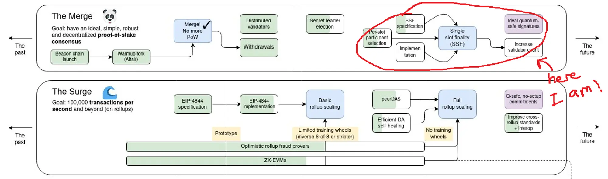
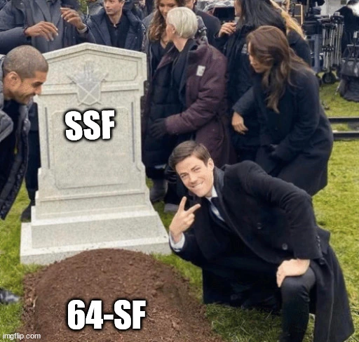
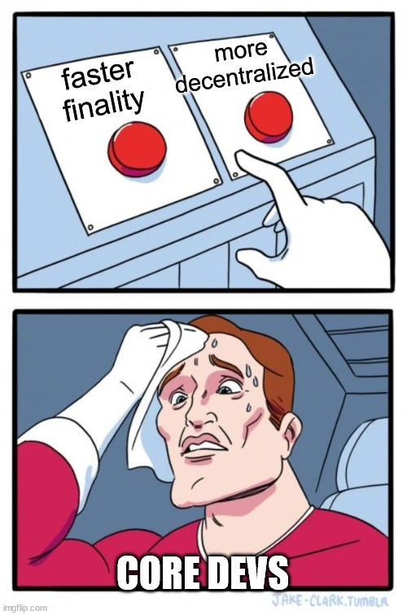

# WTF is…

Single Slot Finality (SSF). 

You may have seen this term on some complicated chart of things that have been built or need to be built on Ethereum. You don’t really know what it means, but it sounds pretty cool and cypherpunk, so it must be important.. right?

SSF is still technically quite far down `The Merge` roadmap, so we don’t expect it any time in the next few years. But if you are interested in what lies down the road (maybe because you need a greater dose of hopium 🎈), let’s dig more into it!

**Before we go any further, it would help to digest the terms first…**

- *Single -* ok, I’m going to assume you know what this means
- *Slot* - The Ethereum blockchain is organized into epochs and slots. Each epoch is 6.4 minutes long, containing 32 slots of 12 seconds.
- *Finality* - a transaction is considered as *finalized* when there are strong guarantees that this transaction can no longer be altered or removed from the blockchain (this is commonly termed as block re-orgs). This means that nobody can tamper with blocks that are finalized, not without being severely punished anyway.

**Put together, Single Slot Finality means that blocks will get finalized within 1 slot (12 seconds)!**

# But why SSF?

At the time of writing (June 2024), Ethereum has 64-slot finality (2 epochs). Yes, this means that within that 12.8 minute window, there is a chance (albeit small) that your transaction may be changed. These changes are usually minor, involving not more than 3 to 5 recent blocks. This sucks when you thought that you had perfectly timed buying the bottom of your favorite memecoin. This sucks even more if you were running an L2 and trying to communicate with the base L1 about WTF is going on down there (and not to mention on all the other L2s as well).

Rollups (L2s) currently have to figure out how to gracefully manage such (hopefully, small scale) reorganizations. For example, based rollups (not to be confused with Base L2) have no (centralized) sequencer and rely on the base L1 (in this case, Ethereum) for its sequencing. By reducing the time to finality to a single slot, it makes life a lot simpler for rollups and those transacting on it (AKA you!).

Decentralized bridges often rely on messages being passed from L1 to L2. These often include a short delay time to minimize risk of block reorganizations. As a user, you might have experienced this before — sending funds into the bridge and nervously waiting for your funds to reach your wallet on the other end. SSF will greatly reduce the latency on passing these messages, ensuring faster communications between the base and rollup chains.

Overall, end users may only see slight improvements in UX since Ethereum already works pretty damn well. Block reorganizations are rare occurrences these days. But simplifying the protocol will be huge for those building on Ethereum, [especially given its rollup-centric approach to scaling](https://vitalik.eth.limo/general/2024/06/30/epochslot.html). 

# But why not now?

*Ok, hol’up. If SSF is so great, why not implement it now?* 

Turns out, there are technical challenges to implementing SSF. Remember the strong guarantees we mentioned before? This crypto-economic security is only guaranteed by the ETH staked by validators in Ethereum’s Proof-of-Stake system. The cost of reverting a finalized block is at least 1/3 of the total ETH staked (~32M ETH, or $35B at time of writing). 

Under PoS, validator nodes stake 32 ETH to vote (or, in fancy Ethereum parlance, *attest*) on the next block in the blockchain. Every second, thousands of attestation messages must be propagated across more than a million validator nodes, which then need to individually aggregate and verify all these digital signatures, tallying up the votes until a supermajority consensus is achieved. To do this, several tradeoffs must be considered:

1. **Hardware resources:** the faster the computer, the faster these calculations can be done. But this also increases the cost of validator hardware requirements.
2. **Minimum stake:** higher stakes means fewer validators, making it faster to aggregate and verify attestations across all participants in the network.
3. **Time to finality:** longer windows give more time for validators to complete their attestation duties and tally up the votes. 

## Maximal decentralization FTW

The Ethereum protocol and community have chosen the route to maximal decentralization. To allow *anyone* to run nodes, hardware and bandwidth requirements need to be kept within reach of the everyday person — even if it comes at the cost of longer finality times.

> *But wait*, I hear you say, *not everyone has 32 ETH to run a validator*! *Surely, that’s not within the reach of the everyday person*!
> 

And right you are! This is why protocols are being built on top of Ethereum to help with that. Rocketpool, for example, allows validators to reduce their stake to 8 ETH, with future upgrades planned to reduce that even further to 1.5 ETH. Distributed validator technology (DVT) also opens up the possibility for private staking pools, where multiple operators can chip in to run validators with only a fraction of the stake.

Meanwhile, pieces are being put into place to bring SSF into reality. Changes to [maxEB](https://ethresear.ch/t/increase-the-max-effective-balance-a-modest-proposal/15801) will land in Pectra, allowing operators to consolidate multiple validators into a single node — helping to reduce the number of validators in the validator set. More recently, [Orbit SSF](https://ethresear.ch/t/orbit-ssf-solo-staking-friendly-validator-set-management-for-ssf/19928) has been proposed as a hybrid design to validator set rotation. Further research is needed on whether it is possible to create supersets of validator committees, which would help to reduce the size of each validator set (at the cost of reducing the crypto-economic securities). 

This is not merely an idealistic academic exercise, but one with practical implications. Users are able to run their own nodes on practical home computers, rather than rely on renting a machine from a data center or rely on a third party to access the chain. Decentralized architectures will allow as many people as possible to run their own node, thus ensuring future robustness of the network.

## That’s cool, but that *other* chain does it already

Ah, we now come to the final boss — the **consensus** algorithm.

Tallying up just about a million votes every 12 seconds may be difficult, but what happens when some of the voters are asleep, taking a sick day, or just plain late? Now if it’s only a handful of voters, that’s not a problem, but when it happens to a large number of voters (maybe because the only bridge to the voting center has collapsed)… How do you decide what the consensus is?

Different chains have different approaches to consensus. To appreciate the differences, we need to understand *liveness* vs *finality* in decentralized blockchains. 

- *Finality* - As we learned earlier, *finality* means that blocks can no longer be altered or dropped once they are included.
- *Liveness -* ****On the other hand, *liveness* means that blocks can go on being produced even under the most challenging network circumstances.

**Let’s be real.** Blockchains are imperfect creatures. Validator nodes may fall out of sync due to client bugs, natural disasters, world wars, etc. If the network isn’t sure what the majority is voting for, it can either make a guess (and allow for re-organizations later)… or give up entirely. 

- **Bitcoin’s *Nakamoto* consensus favors *liveness* over *finality***. Under the Proof-of-Work (PoW) algorithm, the correct chain is assumed to be the one which has the most cumulative computational work used to mine it (the PoW version of voting). Bitcoin remains fully available at all times, even if a majority of miners stop mining or worse, turn malicious.
- **Cosmos’ *Tendermint* algorithm favors *finality* over *liveness*.** Blocks are finalized as soon as it gets voted in. However, if more than 1/3 of the validator set stops voting, the network gives up and grinds to a halt. That means that no new transactions can be added to the blockchain until these nodes are (manually) kicked from the voter set. As you can possibly appreciate, manually restarting the network can be difficult when you have a million nodes.
- **Ethereum’s *Gasper* algorithm favors… both!** Under SSF, a hybrid approach will be used. During normal network conditions, blocks will be finalized immediately. However, in the event where a large number of nodes fall out of sync, the fork-choice rule will kick in and blocks will stop finalizing until offline nodes are sufficiently penalized to get automatically ejected from the validator set. Node operators thus have the responsibility to maintain uptime and quickly restore normal network conditions.

# Many (wrong) paths to building a blockchain

There are many paths to building a blockchain. Choosing a compromising path can be disastrous down the line. Ethereum has made several choices in its development roadmap, refusing to compromise on decentralization and liveness. This ensures that the chain always remains available and robust to anyone who needs to use it (*what chain halt?*). Ensuring availability is very important at scale, because any downtime can be catastrophic — especially for systems which need to stay in sync with other off-chain systems (e.g., oracles).

Building fast finality into the protocol is complicated. Trying to achieve both liveness and (fast) finality in a large decentralized system is something that has not been achieved before. This is why SSF has been placed further down the roadmap. At some point, fast finality will be achieved — but in the meantime, research must go on.